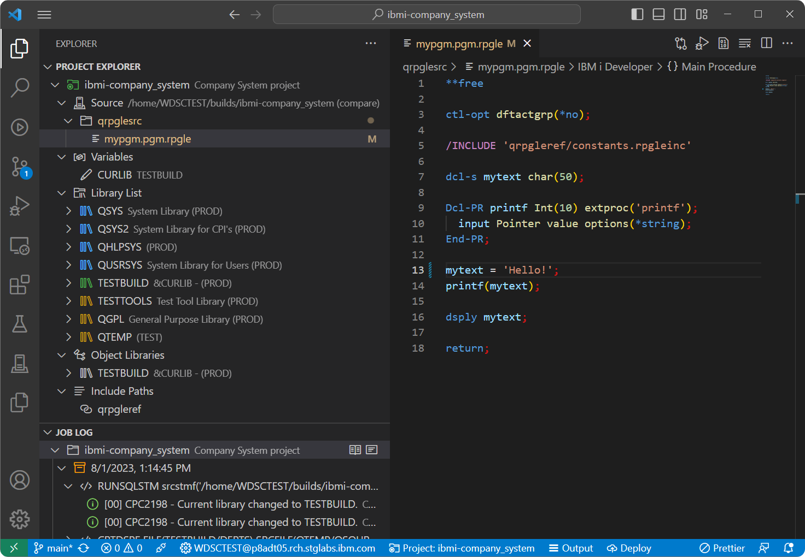

# IBM i Project Explorer

The IBM i Project Explorer supports developing IBM i applications using buildable local projects in Visual Studio Code. Leverage the Project Explorer viewer to manage a project's library list, variables, object libraries, include paths, and much more. Utilize the Job Log viewer as well to easily visualize the contents of your job logs after having run a build or compile.

## Requirements

Since the IBM i Project Explorer is built on top of the Code for IBM i extension, check out their [requirements](https://halcyon-tech.github.io/docs/#/./README?id=requirements). In particular, make sure the SSH Daemon is started on te IBM i you will be connecting to.

## Getting Started

To get started with using the IBM i Project Explorer, refer to the [installation](pages/welcome/installation.md) instructions to install all the necessary extensions. Once complete, read more about the nature of [IBM i projects](pages/ibm-i-projects/overview.md) and getting started by [connect to a remote system](pages/projectExplorer/connect-to-a-remote-system).