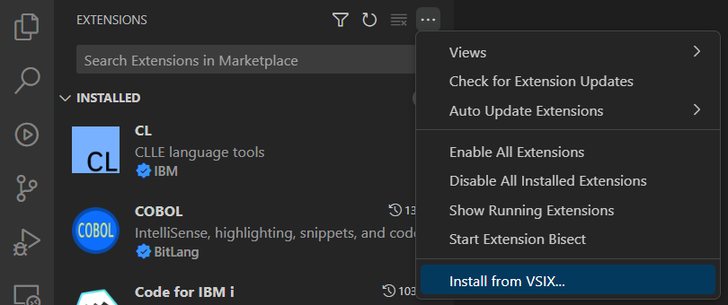
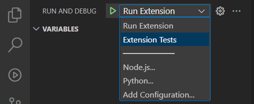
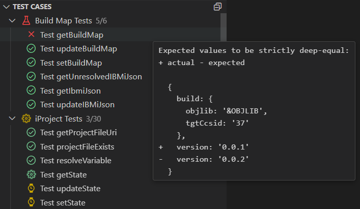
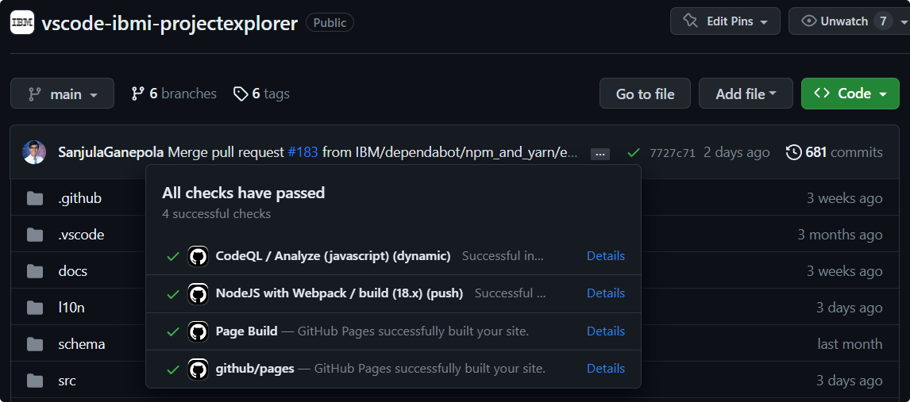

# Getting Started

## Project Structure

The IBM i Project Explorer has the following notable directories for development, testing, and documentation:

- `src` contains the TypeScript code
  - `testing` contains the test framework and suites
- `l10n` contains the set of strings found in all TypeScript files for translation purposes
- `schema` contains the schemas contributed by the extension
- `types` contains the type definitions for the exported API
- `docs`: contains the documentation

?> To learn more about the general structure of a VS Code extension, check out the documentation on [extension anatomy](https://code.visualstudio.com/api/get-started/extension-anatomy).

---

## Developing and Debugging

1. Install VS Code and Node.js
2. Clone this repository
3. `npm install`
4. `Run Extension` from VS Code

---

## Packaging

To package the VS Code extension as a `.vsix` file, use the [vsce](https://code.visualstudio.com/api/working-with-extensions/publishing-extension#vsce) CLI tool:

```bash
vsce package
```

Install the `.vsix` from the **Extensions** view in VS Code.



---

## Testing

To run the tests, start debugging the **Extension Tests** configuration.



After the Extension Development Host is launched, connect to a system where the tests will run. After connecting, the tests will start running automatically. The tests being executed along with the results can be seen in the **Test Cases** view. This information is also outputted to the **Debug Console**.



## Release

To start the release process, a pull request with the 4 changes below should be created and merged. For reference, refer to the pull request named [Bump to 1.2.0](https://github.com/IBM/vscode-ibmi-projectexplorer/pull/162).

1. Update the `version` attribute of the extension's [package.json](https://github.com/IBM/vscode-ibmi-projectexplorer/blob/main/package.json).
2. Run `npm install` in the repository to update the `version` attribute in the extension's [package-lock.json](https://github.com/IBM/vscode-ibmi-projectexplorer/blob/main/package-lock.json).
3. Update the `version` attribute of the types' [package.json](https://github.com/IBM/vscode-ibmi-projectexplorer/blob/main/types/package.json).
4. Update the [CHANGELOG.md](https://github.com/IBM/vscode-ibmi-projectexplorer/blob/main/CHANGELOG.md) with the new version. To get the features/fixes to list under the version, start a new [Github release](https://github.com/IBM/vscode-ibmi-projectexplorer/releases), but **do not publish it**. Instead, simply set a new tag and select generate release notes. Copy these auto generated release notes to the `CHANGELOG.md` file. To improve readability, keep the core description for each bullet, but remove the information about who made the change and which pull request it was from. The release you just created can be discarded.

Once this pull request is merged, you can also optionally force Dependabot to scan for any updates to all dependencies in the `package.json` or github workflows. Dependabot is configured to run weekly, but this can be beneficial to do before a release. To see the results of a Dependabot scan, navigate to the repository's [dependency graph](https://github.com/IBM/vscode-ibmi-projectexplorer/network/updates) and click the `Last checked <#> days ago` link next to each item. To force a scan, click the `Check for updates` button. Once Dependabot has finished, it will automatically create pull requests for each dependency that can be updated. These should be reviewed and merged  if appropriate.

After all pull requests have been merged, ensure that all Github checks are successfully passing. This can be done by clicking the icon to the left of the current commit on the [main branch](https://github.com/IBM/vscode-ibmi-projectexplorer). If there are any failures, refer to the [workflow logs](https://github.com/IBM/vscode-ibmi-projectexplorer/actions).



Once these steps have been completed, you can now create and publish a Github release just like in step 4 from above. This will trigger the Github action to run which will automatically publish the extension to the VS Code Marketplace, publish the extension to the Open VSX Registry, and publish the types to NPM. Refer to the Github action log ([Release and Publish to the Marketplace and Open VSX](https://github.com/IBM/vscode-ibmi-projectexplorer/actions/workflows/release.yaml)) to see the status of the job. Once the job has finished, it can take a few minutes for the registries to update with the new extension and types.