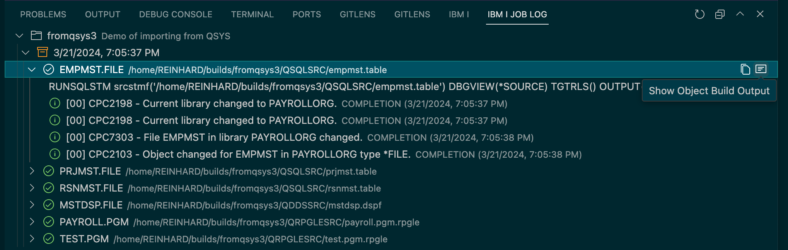
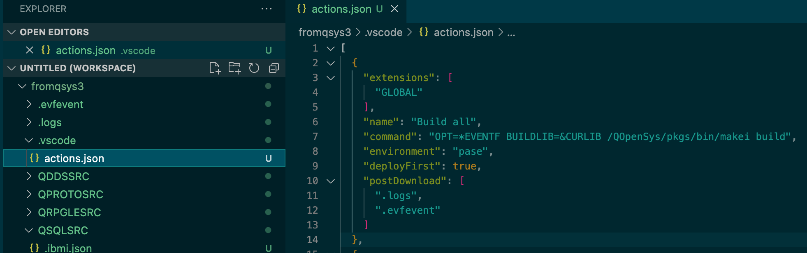

# Viewing Job Log

Project Explorer provides a view in the `IBM i Job Log` panel to display all of the information you would get in an IBM i job log and spool files after a build.  This will be very helpful when diagnosing why a build failed.

## Job log tree contents

### Project level
The top level of this tree is the project name with the project description as its details.  This allows the job logs of multiple projects to be shown in this view.  Only the latest build is persisted in the project, but the other jobs are kept in memory until the workspace is restarted or the `Clear Previous Job Logs` action on the project is run.

The `Show Job Log` action, which is also available inline, will load the joblog.json file with the raw data into the editor.  This might be useful for searching, etc.

### Job log level
The next level is the timestamp when the build or compile was run and represents all the command run for that particular build.
The commands can be toggled via the inline action to show all executed commands or only those that failed.

If the action above is selected, all successful commands are filtered out so that you can focus on the failing ones.  This can be very useful when lots of objects are being built.

To help zero in on the problem, there is also an action to filter the messages, so that you can set the minimum severity of messages you would like to see.

In this example we select the minimum severity of the messages to be 10.

As a result we see all of the information messages being filtered out so we can see that actual failures.

 

### Object level
The children of a job log are all the ILE objects being built.  The description is the source in the IFS that is being compiled into that object.

 

The actions available on the object, both in the context menu and the inline menu include `Copy` and `Show Object Build Output`.  The `Copy` action copies the command into the clipboard.  This allows you to paste it into the 5250 or PASE where you can run the command in isolation.
The `Show Object Build Output` will show the equivalent of spool file output including the compile listing and any standard error and output from PASE commands.  Note that the compile errors will also be shown in the `Problems` view but sometimes there are other reasons for a command to fail and they can be seen here.

## Messages level

On the next level the first item is unique. It is the compile command being run in QSYS to build the target.   This command can be copied using the `Copy` action.

The remaining items are the messages that were produced in the job log when executing this command.  While there are no actions on messages, the hover shows all of the message details including second level help.

 

## Where does the data come from
Build commands such as BOB (https://github.com/IBM/ibmi-bob) and ARCAD generate a file named `.logs/joblog.json`. They also generate text files in the same directory with names like `target_object.splf` that contain the PASE standard out or spool file equivalent for each command, including the compile listing.  These files are copied to the `.logs` directory in the project root.

This copy process is automatic when invoking build or compile action for `IBM i Project Explorer` projects. For `Code for IBM i` actions the downloading of these files can be configured by the `postDownload` attribute in the `actions.json`  file.  The `.evfevent` directory specified here is necessary to get the compiler errors in the `Problems` view.

