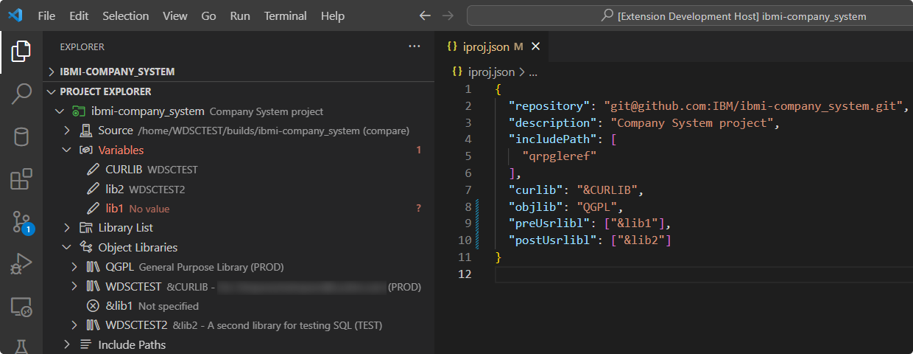

# Browse Object Libraries

The **Object Libraries** heading is another location to browse for libraries defined in the `curlib`, `objlib`, `preUsrlibl`, and `postUsrlibl` of the project's `iproj.json`.

