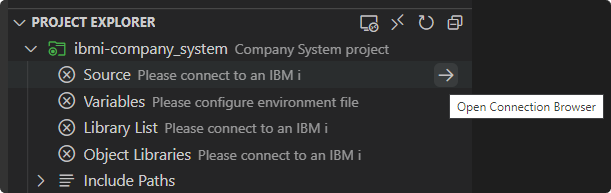
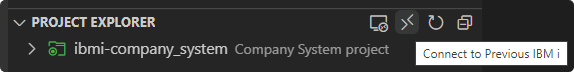

# Connect to a Remote System

To connect to a remote IBM i, expand any project and select the **Open Connection Browser** inline action. You can also manually navigate to the connections view by selecting the **IBM i** view container in the activity bar on the left-hand side. From here you can connect to a connection which you have defined previously or you can use the **New Connection** action to be presented with a form to define your connection.

From the **Project Explorer** view, you also have the option to quickly connect to a previous connection using the **Connect to Previous IBM i** action.

?> To learn more about connecting to a remote system using Code for IBM i, check out their [documentation](https://halcyon-tech.github.io/docs/#/pages/login).