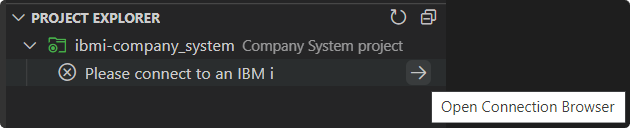
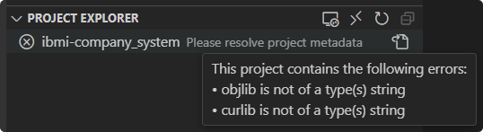

# Create New Project

To get starting with an IBM i project, create a folder and open it in the workspace. For a workspace folder to be treated as an IBM i project, it must contain an `iproj.json` file. This can be done from the **Project Explorer** view using the **Create iproj.json** action. This will prompt you to enter a description for the project and then create the file.

Upon creating this file, you can now get started with development. Refer to the subsequent pages on how to accomplish different tasks or manage different aspects of the project.

> [!NOTE]
>
> Note that to work with multiple projects at the same time, add each project as a separate workspace folder.

In the scenario you ever find that your project's `iproj.json` file is corrupt, hover on the project in the **Project Explorer** view to see if there are any errors present. If there are errors, use the `Open iproj.json` action and refer to the **Problems** view to see how you can resolve them.

> [!TIP]
>
> To get started with working on source code locally in your project from source physical files in QSYS, check out the documentation on how to [migrate source](pages/projectExplorer/migrate-source.md).