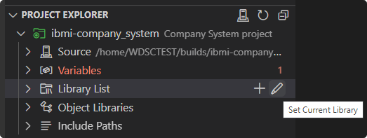
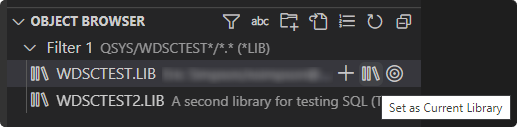
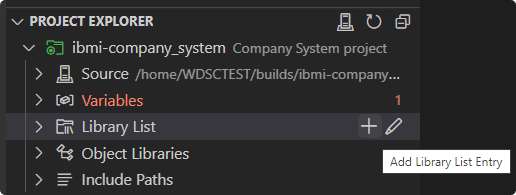
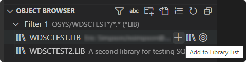
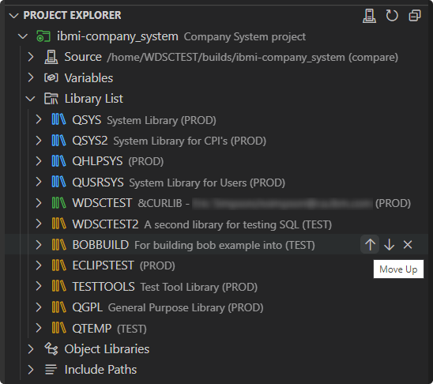
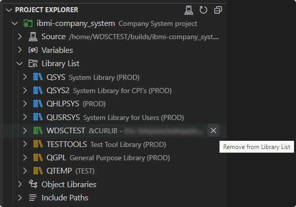

# Manage the Library List

The **Library List** heading is where you will be able to view your project's library list. The library list is initially set according to your user profile, but can be modified based on the fields set in the project's `iproj.json` file.

Refer to the following guide to distinguish the types of libraries in the library list based on color:

- System libraries: Blue
- Current library: Green
- User libraries: Yellow

## Set the Current Library

To set the project's current library, use the **Set Current Library** action. If the `curlib` field in the project's `iproj.json` file is either a hardcoded library or not specified, this action will set it to be the `&CURLIB` variable with the value set in the `.env` file as the library's name. However, if the `curlib` field is already set to a variable, the variable will be kept and the value will be simply updated.

In the case you would first like to browse for the library to set as the current library, you can leverage the **Object Browser** view. Here you can query for the library and use the **Set as Current Library** action.

## Add to the Library List

Similar to setting the current library, you can add to the set of user libraries by using the **Add Library List Entry** action. After inputting the library name, you will also be prompted to select where to position the library. Adding to the beginning of the library list will add to the `preUsrlibl` field in the `iproj.json` whereas adding to the end of the library list will add to the `postUsrlibl` field.

You also have the freedom to query for libraries in the **Object Browser** view and then use the **Add to Library List** action for when you would like to first browse for libraries before adding them.

## Reorder the Library List

Libraries defined in the `preUsrlibl` or `postUsrlibl` field in the project's `iproj.json` file can be reordered directly in the **Project Explorer** view. Note that you will only be able to reorder the libraries within each group itself. This can be done using **Move Up** or **Move Down** actions accordingly.

## Remove from the Library List

Libraries defined in the project's `iproj.json` are the only libraries which can be removed from the library list. This can be done using the **Remove from Library List** action. Note that removing any library which corresponds to a variable will only remove the value from the `.env` file and not the variable itself from the `iproj.json` file.

