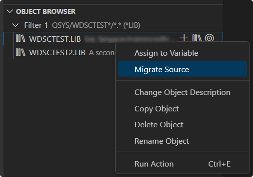
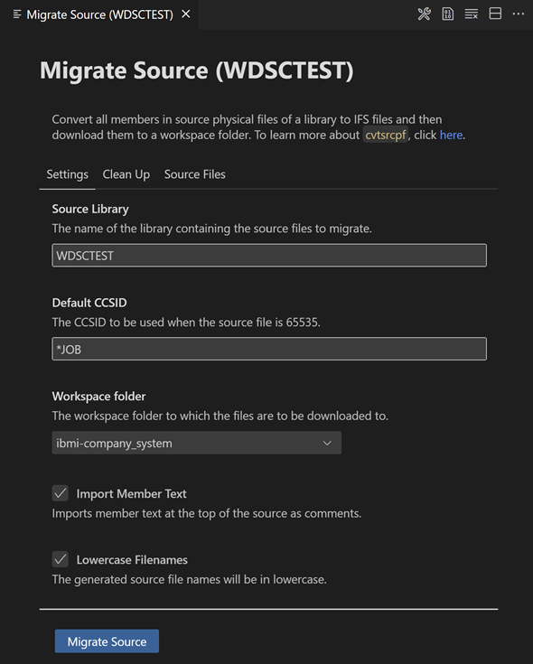
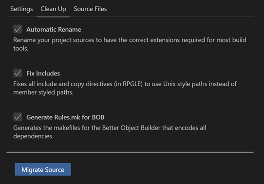
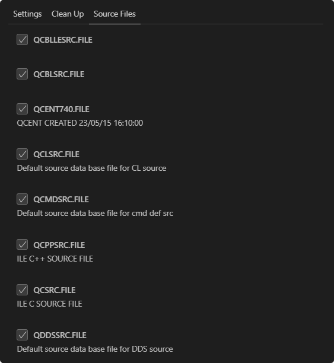

# Migrate Source

A quick and easy way to get started with local development is to begin with migrating source from QSYS. This source migrating process leverages the `cvtsrcpf` command in `makei` as a source code conversion tool. This command essentially converts all members in a given source physical file to properly encoded, terminated, and named source files in an IFS directory. Following this conversion, the files will be bundled into a tar file which will be downloaded and extracted into the project so that you can begin with local development.

?> To learn more about this source code conversion too, check out the documentation on [cvtsrcpf](https://ibm.github.io/ibmi-bob/#/cli/makei?id=cvtsrcpf).

## Start the Source Migration

To begin the source migration process, browse for the library containing the source physical files you would like to migrate using the **Object Browser** view. Once you have found the desired library, use the **Migrate Source** action. This can also be done on any library in the **Project Explorer** view.

## Configure Settings

This action will pop up a form in the editor for you to configure the migration process. Under the **Settings** tab, you can specify an optional CCSID value to be used when source physical file is 65535. If not specified, the `*JOB` CCSID will be used. You can also adjust the workspace folder to which the files are to be downloaded to.

## Enable Clean Up

As part of this source migration process, you can enable the use of another extension called **Source Orbit** to assist with cleaning up the migrated code. This extension offers the ability to automatically have the migrated source extensions corrected and include/copy directives fixed to use Unix style paths.

> [!NOTE]
>
> The use of these two clean up features requires the **Source Orbit** extension to be installed which can be done from the Visual Studio Code Marketplace: [Source Orbit]().

?> To learn more about this clean up process, check out the documentation on [Source Orbit](https://ibm.github.io/sourceorbit/#/).

## Select Source Files

The last step in this process is to select the source physical files in the library which you would like to migrate. Once this is done, select the **Migrate Source** button at the bottom to initiate the process.

