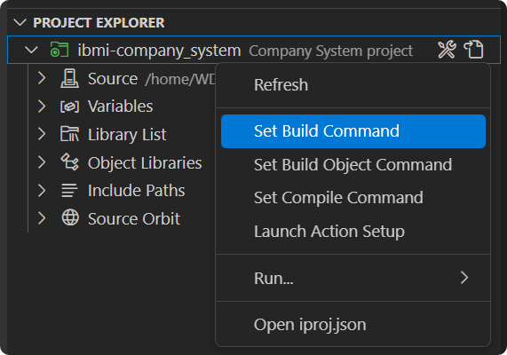
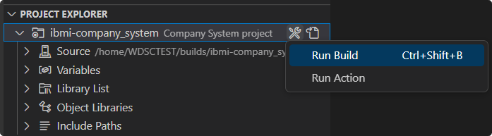
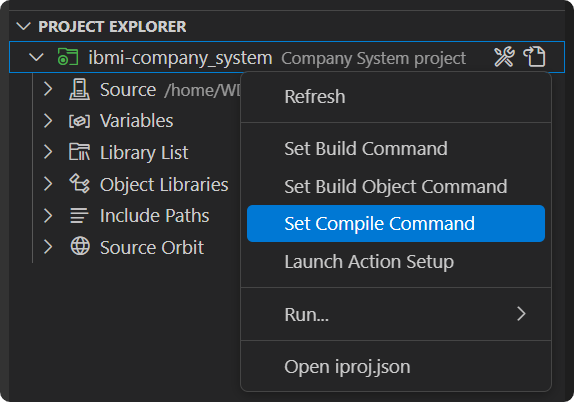
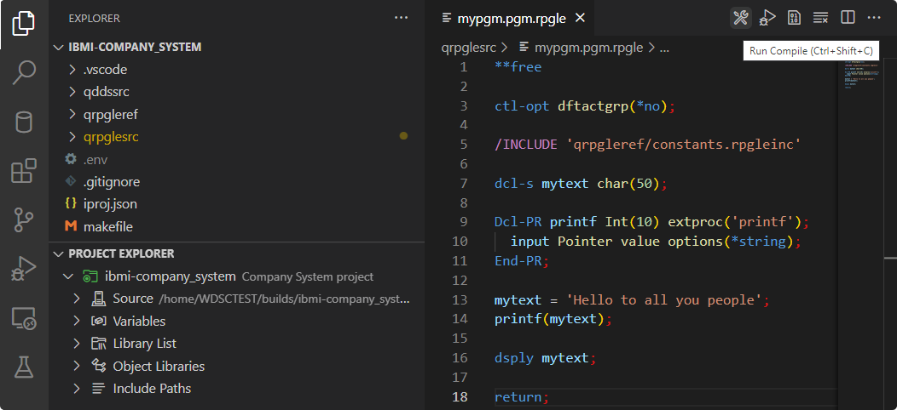
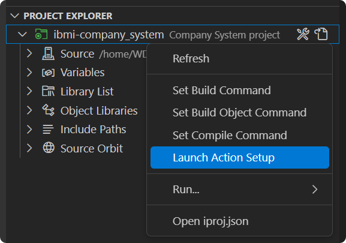
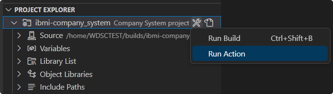

# Run Builds, Compiles, and Actions

The build or compiles of a project are based on the `buildCommand` and `compileCommand` fields in the project's iproj.json. Similarly, another solution is to use an `actions.json` file to store configurations for different technologies.

## Run a Build

Before running a build, the project's build command must be set. This can be done using the **Set Build Command** action on the project. Here you can leverage any build tool such as `elias` in ARCAD Builder or `makei` in `ibmi-bob`.



To then launch a build, use the **Run Build** action on the project heading or the `ctrl+shift+b` shortcut (`cmd+shift+b` on Mac). This will first deploy the project and then invoke the build command. To view the output of this build process, navigate to the **Output** view and select the **IBM i Output** channel.



## Run a Compile

Similar to the build command, the project's compile command must be first set using the **Set Compile Compile** action on the project.



To compile a directory or file, this can be achieved from several locations:

- To compile the active text editor in which you are working in, using the **Run Compile** action located at the top right of the editor, in the VS Code command palette, or by simply using the `ctrl+shift+c` shortcut (`cmd+shift+c` on Mac)
- To compile an entire directory or a specific file, use the right-click **Run Compile** action on any file or directory in the **File Explorer** or under the **Source** heading



## Run an Action

An alternative to using the build or compile command is to leverage the use of Code for IBM i workspace actions. These actions are stored in `.vscode/actions.json` at the root of the project and should be pushed to the Git repository. To generate an initial `actions.json` file, use the **Launch Action Setup** action on the project. Here you will be prompted to select from a set of pre-defined actions.



Refer to the example below of having setup a project to use `ibmi-bob`:

```bash
[
  {
    "extensions": [
      "GLOBAL"
    ],
    "name": "Build all",
    "command": "OPT=*EVENTF BUILDLIB=&CURLIB /QOpenSys/pkgs/bin/makei build",
    "environment": "pase",
    "deployFirst": true,
    "postDownload": [
      ".logs",
      ".evfevent"
    ]
  },
  {
    "extensions": [
      "GLOBAL"
    ],
    "name": "Build current",
    "command": "OPT=*EVENTF BUILDLIB=&CURLIB /QOpenSys/pkgs/bin/makei compile -f {filename}",
    "environment": "pase",
    "deployFirst": true,
    "postDownload": [
      ".logs",
      ".evfevent"
    ]
  }
]
```

After having setup the actions, you can invoke them using the **Run Action** action on the project. This can also be done from the top right of the active text editor or by simply using the `ctrl+e` shortcut (`cmd+e` on Mac).

