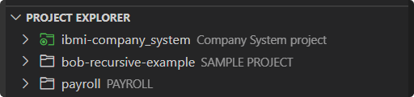

# Set the Active Project

The notion of an active project is used to simplify actions present in other views outside the **Project Explorer** and is more relevant when with several projects at the same time. In particular, certain actions in the **Object Browser** and **IFS Browser** views require an associated project to which that action should be invoked on. For example, using the **Assign to Variable** action on a library in the presence of there being several projects in the workspace requires some way to indicate which project this action is for. This is the relevance of defining an active project.

## Single-folder Workspaces

When working in a single-folder workspace, the project which you have open will automatically be set as the active project. Thus any actions from outside the **Project Explorer** will be run against this singular project.

## Multi-root Workspaces

When working in a multi-root workspace, there can now exist the presence of many projects at once. By default the first workspace folder will be treated as the active project and is highlighted with a green project icon.

To switch the active project, use the **Set Active Project** action. Note that the active project will also automatically update based on the active text editor.

An alternative to viewing the active project from the **Project Explorer** view is using the status bar item located at the bottom of the VS Code workbench. Clicking this status bar item can also be used to switch the active project.

