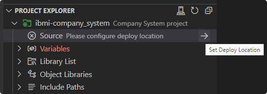
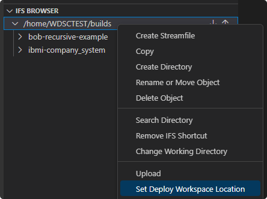
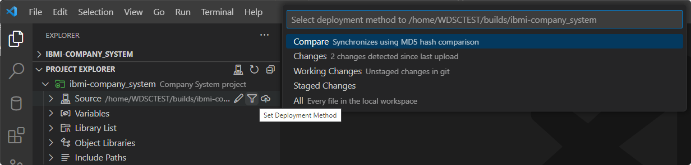
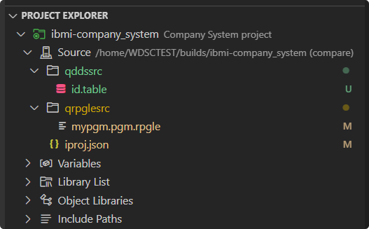
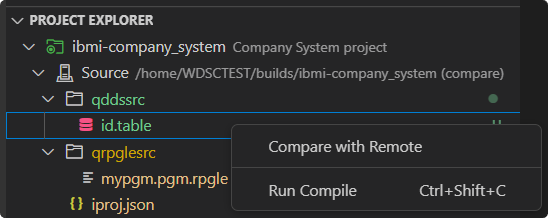
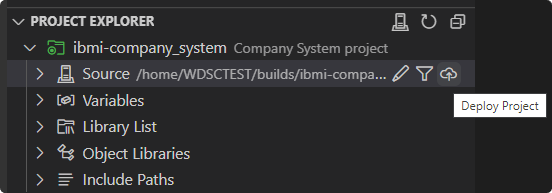

# Source and Deployment

The **Source** heading is what will be used to work with the source files that exist locally in your workspaces. From here you will be able to visualize, compare, and deploy your local source files to your deploy location in the IFS which is where you will be running your builds and compiles out of.

## Set the Deploy Location

To set the project's deploy location, use the **Set Deploy Location** action on the **Source** heading. You can modify this location later on as well using the **Edit Deploy Location** action. The suggested deploy location is `/home/<user>/builds/<project_name>`.

If you need to browse to the exact deploy location which you would like to set, this can be done frm the **IFS Browser** by creating an IFS shortcut and using the right-click **Set Deploy Workspace Location** action from any directory.

## Set the Deployment Method

Once the deploy location is set, you can use the **Set Deployment Method** action to set the deployment method to be used when deploying the project.

There are five options for deployment:

1. `Compare`: This method will perform a MD5 hash comparison and upload those file which are different. 
2. `Changes`: This method will upload all files which have been changed since the last upload.
3. `Working Changes`: This method only works if the project is associated with a Git repository as it will upload files that have been been changed since the last commit (unstaged and staged).
4. `Staged Changes`: The same as the `Working Changes` method, but only uploads staged and indexed files.
5. `All`: This method will upload all files project excluding those that are listed in the `.gitignore` file.

In addition to affecting the deployment process, the deployment method for the project will also impact the content rendered under the **Source** heading. The source files and directories visualized here are a direct reflection of what will be deployed based on the chosen deployment method.

For files that have been deployed, you have the ability to compare the local copy versus the remote using the **Compare with Remote** action. 

## Deploy the Project

To start the deployment process, you can use the **Deploy Project** action on the **Source** heading. This will upload the project's local files to the deploy location using the current deployment method. To view the output of this deployment process, navigate to the **Output** view and select the **IBM i Deployment** channel.

