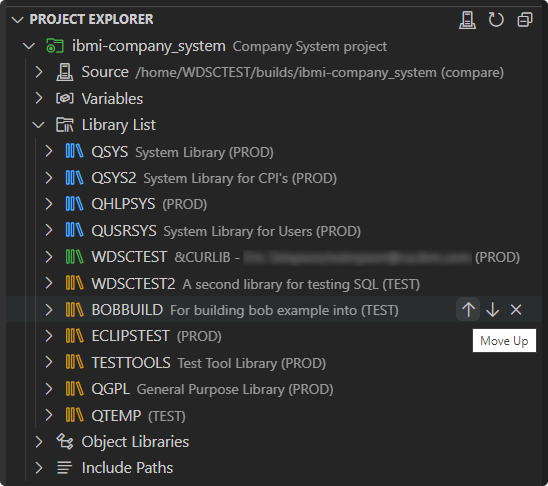

# Updating Include Paths

The `includePath` field in the project's `iproj.json` file specifies directories to be searched for includes or copy files. These set of directories can be managed using the **Include Paths** heading.

## Adding Include Paths

Adding to the set of include paths is as simple as using the **Add to Include Paths** action to be prompted for the path to add. Note that any absolute path will be resolved based on the local path to the workspace or the project's deploy location.

To add an include path to a directory in the local project, leverage the **Add to Include Paths** action on any directory in VS Code **File Explorer**.

Simiarly, to add an include path to a directory in the IFS, leverage the same action in the **IFS Browser**.

## Reordering Include Paths
To reorder include paths, you can use the **Move Up** and **Move Down** actions on include paths to reorder them.

## Removing Include Paths
To remove an include path, you can use the **Remove from Include Paths** action. Note that removing any include path which corresponds to a variable will only remove the value from the `.env` file and not the variable itself from the `iproj.json` file.

