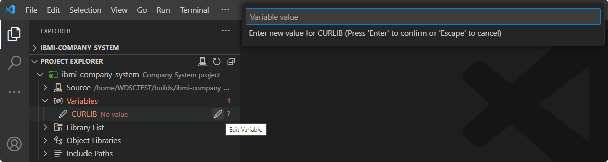
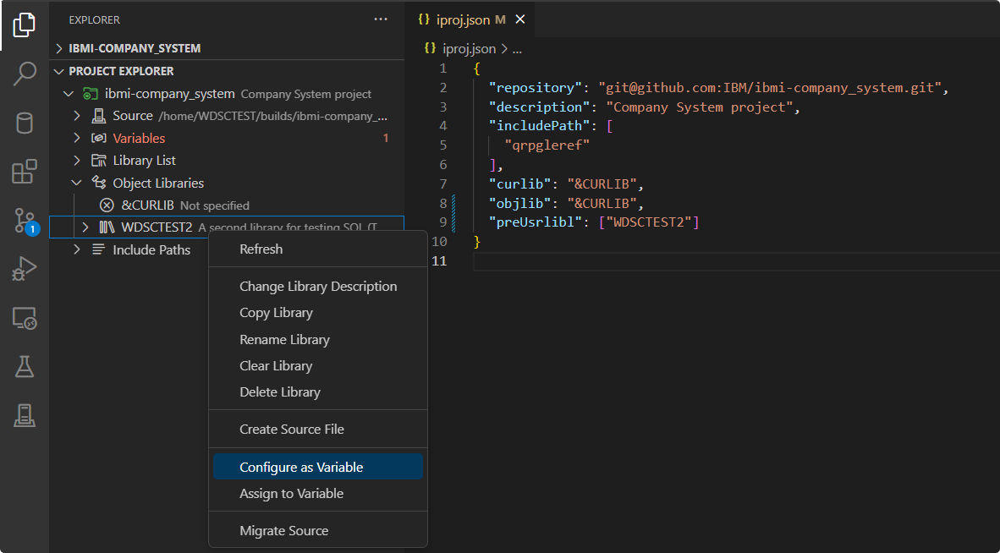

# Work with Variables

The project metadata for IBM i projects support the use of variables in the following fields: `objlib`, `curlib`, `preUsrlibl`, `postUsrlibl`, `setIBMiEnvCmd`, `buildCommand`, `compileCommand`, and `includePath`. These variables are always prefaced with an &. By levering the use of variables, the same project definition can be used to target a different build library from one developer to another. The **Variables** heading is where you will be able to visualize these variables.

## Create Environment File

To get started with viewing and defining project variables, there must exists a root level `.env` file which will be used for storing the value of these variables. This can be done by using the **Create .env** action.

> [!ATTENTION]
> To avoid accidentally pushing your `.env` file to your Git repository, make sure that you add it as an entry into your `.gitignore` file.

## Edit Variable

Listed under the **Variables** heading are all variables used in the root level `iproj.json` or in any `.ibmi.json` within the project. When there are variables which do not have a value assigned, the heading itself will have a red decoration to indicate the number of unresolved variables. To assign a value to a variable, use the **Edit Variable** action. This will be stored in the project's `.env` file.

## Assign to Variable

Instead of manually inputting the value of a variable, you also have the ability to assign a library names or directory to a variable using the **Assign to Variable** action. This can be done from a library in the **Project Explorer** view or the **Object Browser** as well as directories in the **IFS Browser**.

## Configure as Variable

For libraries or include paths which are hardcoded in the project's `iproj.json` file, they can be converted to variables using the **Configure as Variable** action. This will substitute the hardcoded value for a variable which you will provide and set the value of this variable to be the hardcoded value.

