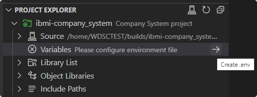

# Working with Variables
The project metadata for IBM i projects support the use of variables in the following fields: `objlib`, `curlib`, `preUsrlibl`, `postUsrlibl`, `setIBMiEnvCmd`, `buildCommand`, `compileCommand`, and `includePath`. These variables are always prefaced with an &. By levering the use of variables, the same project definition can be used to target a different build library from one developer to another.

The **Variables** heading is where you will be able to visualize the set of variables defined in the iproj.json. To assign a value to a variable, use the **Edit Variable** action. The values for all variables will be stored in a `.env` file in the root of the project.

> [!ATTENTION]
> To avoid accidently pushing your `.env` file to your Git repository, make sure that you add it as an entry into your `.gitignore` file.

## Assign to Variable

Instead of manually inputting the value of a variable, you also have the ability to assign a library names or directory to a variable using the **Assign to Variable** action. This can be done from a library in the **Project Explorer** view or the **Object Browser** as well as directories in the **IFS Browser**.

## Configure as Variable

For libraries or include paths which are hardcoded in the project's `iproj.json` file, they can be converted to variables using the **Configure as Variable** action. This will substitute the hardcoded value for a variable which you will provide and set the value of this variable to be the hardcoded value.

