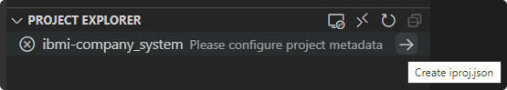

# Project Explorer

## Connecting to a Remote System

To connect to a remote IBM i, expand any project and select the **Open Connection Browser** inline action. You can also manually navigate to the connections view by selecting the **IBM i** view container in the activity bar on the left-hand side.

---

## Source

---

## Variables

---

## Library List

---

## Object Libraries

---

## Include Paths

---

## Active Projects

---

## Migrate Source