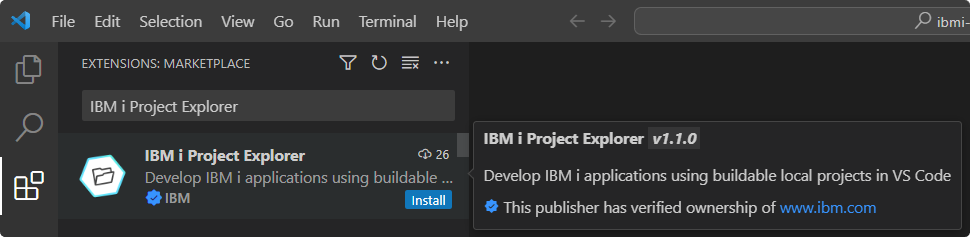
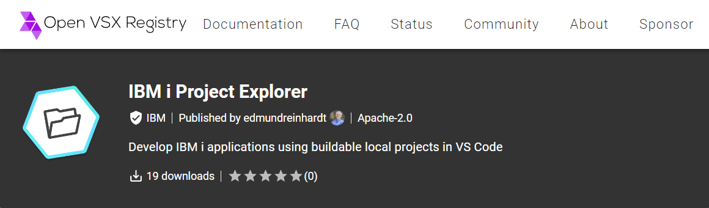
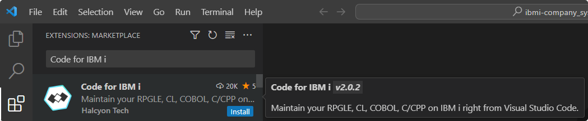

# Installation

## VS Code Marketplace

The IBM i Project Explorer extension can be installed from the Visual Studio Code Marketplace: [IBM i Project Explorer](https://marketplace.visualstudio.com/items?itemName=IBM.vscode-ibmi-projectexplorer).

---

## Open VSX Registry

The extension can also be installed from the Open VSX Registry: [IBM i Project Explorer](https://open-vsx.org/extension/IBM/vscode-ibmi-projectexplorer).

---

## Code for IBM i

Since the IBM i Project Explorer extension is built on top of the Code for IBM i extension, you will need to install this extension as well. This can be done from the Visual Studio Code Marketplace: [Code for IBM i](https://marketplace.visualstudio.com/items?itemName=HalcyonTechLtd.code-for-ibmi).

