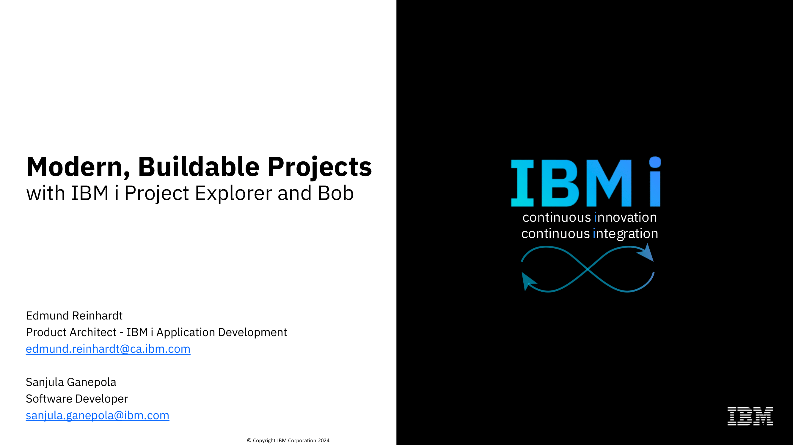

# Tutorials

?> Have you given a presentation or created a video of using IBM i Project Explorer or Bob? Share it with the community by opening a GitHub issue with a link to your tutorial [here](https://github.com/IBM/vscode-ibmi-projectexplorer/issues) and we will add it to this page!

## Modern Buildable Projects with IBM i Project Explorer and Bob

Learn about the challenges with build on IBM i, how local development overcomes these problems, how Bob and IBM i Projects tie into local development, and lastly the ins and outs of IBM i Project Explorer. Click [here](https://github.com/SanjulaGanepola/ibmi-talks/blob/main/Modern%20Buildable%20Projects%20with%20IBM%20i%20Project%20Explorer%20and%20Bob/Modern-Buildable-Projects-with-IBM-i-Project-Explorer-and-Bob.pdf) to view the full presentation.

✨ Courtesy of [Sanjula Ganepola](https://www.linkedin.com/in/sanjulaganepola/) & [Edmund Reinhardt](https://www.linkedin.com/in/edmundreinhardt/)!

    

## BOB for IBM i Tutorial

Learn about how to use IBM i Project Explorer and Bob in VS Code. This session covers an end to end example of how to migrate source into Git, what local development looks like with IBM i projects, how to build & compile your project, and how to diagnose compile errors with the help of diagnostics & the job log view. Click [here](https://www.youtube.com/embed/6Xks0NmCUMM) to watch the full video.

✨ Courtesy of [Alan Seiden](https://www.linkedin.com/in/alanseiden/) & [Edmund Reinhardt](https://www.linkedin.com/in/edmundreinhardt/)!

<iframe height="480" width="500" 
    src="https://www.youtube.com/embed/6Xks0NmCUMM"> 
</iframe>

## ibmi-bob: Installation and introduction

Learn the basics of how to install and use Bob in the command line. This session delves into the intelligent build mechanisms of Bob as well covering specifics about Rules.mk files. Click [here](https://www.youtube.com/embed/OojAydEUWIU) to watch the full video.

✨ Courtesy of [Liam Allan](https://www.linkedin.com/in/worksofbarry/) & [Edmund Reinhardt](https://www.linkedin.com/in/edmundreinhardt/)!

<iframe height="480" width="500" 
    src="https://www.youtube.com/embed/OojAydEUWIU"> 
</iframe>